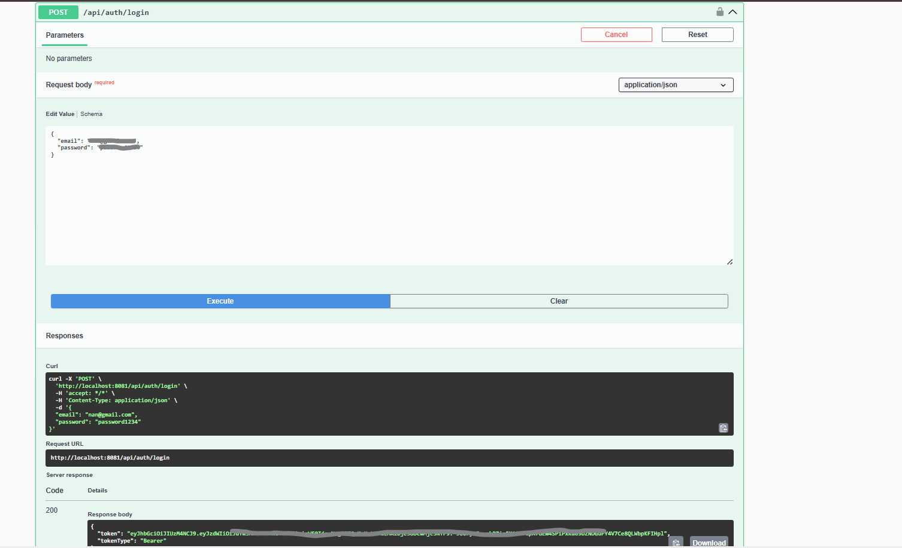
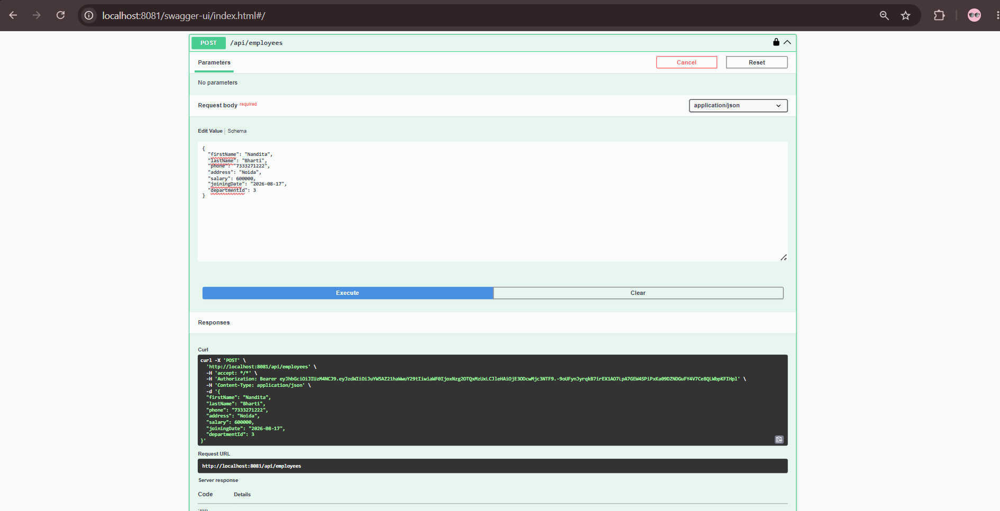
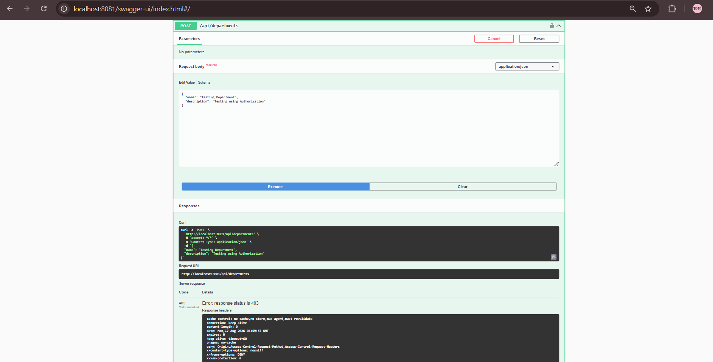
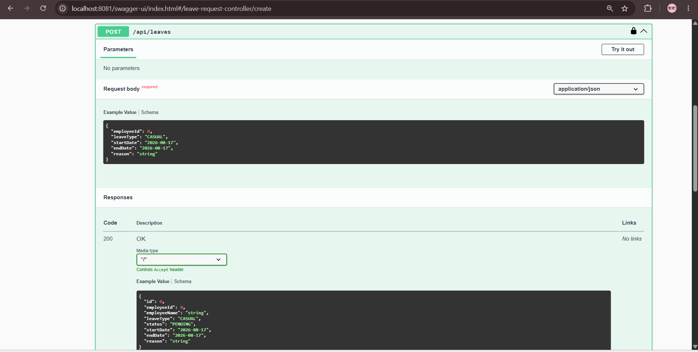
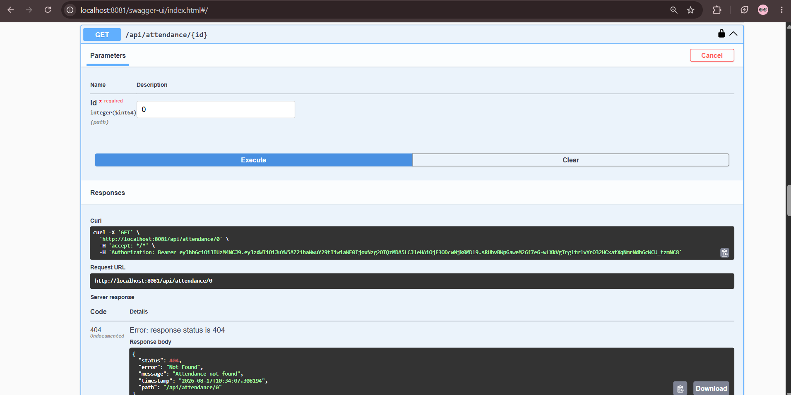

# 🧑‍💼 Employee Management System

A secure, production-style **RESTful Employee Management System** built with **Java, Spring Boot, Spring Security, JWT, JPA/Hibernate, and MySQL**.

The project exposes APIs for employee management, departments, attendance, leave management, and employee documents — complete with authentication, role-based authorization, request validation, centralized exception handling, and Swagger API documentation.

---

## 📑 Table of Contents

- [Features](#-features)
- [Security](#️-security)
- [Architecture](#-architecture)
- [Project Structure](#-project-structure)
- [Technologies Used](#️-technologies-used)
- [API Endpoints](#-api-endpoints)
- [API Documentation](#-api-documentation)
- [Getting Started](#️-getting-started)
- [Example Authentication](#-example-authentication)
- [Exception Handling](#-exception-handling)
- [Validation](#-validation)
- [API Testing](#-api-testing)
- [Future Enhancements](#-future-enhancements)
- [What I Learned](#-what-i-learned)
- [Author](#-author)

---

## 🚀 Features

### 🔐 Authentication & Authorization
- User registration
- User login
- JWT-based, stateless authentication (Spring Security)
- Password encryption using BCrypt
- Role-based authorization — `ADMIN`, `HR`, `EMPLOYEE`

### 👨‍💼 Employee Management
- Create, view, update, delete employees
- Employee search
- Pagination and sorting
- Department assignment

### 🏢 Department Management
- Create, view, update, delete departments

### 🕐 Attendance Management
- Create, view, update, delete attendance records
- Check-in and check-out tracking
- Attendance status management

### 📝 Leave Management
- Create, view, update, delete leave requests
- Leave approval / rejection workflow
- Leave status management

### 📄 Document Management
- Add, view, update, delete employee documents
- Associate documents with employees

> Currently, the project stores document metadata and file URLs. Actual cloud file uploading can be added as a future enhancement.

---

## 🛡️ Security

The application uses **Spring Security + JWT** to secure REST APIs.

### Authentication Flow

```
User
 │
 ├── Register
 │
 └── Login
       │
       ▼
   Authentication
       │
       ▼
     JWT Token
       │
       ▼
 Authorization Header
       │
       ▼
 Protected API
```

Example header:

```
Authorization: Bearer <JWT_TOKEN>
```

### Role-Based Access Control

| Role       | Access                          |
|------------|----------------------------------|
| `ADMIN`    | Administrative operations        |
| `HR`       | HR-related operations            |
| `EMPLOYEE` | Employee-level authenticated access |

Sensitive operations such as employee/department management and leave approval are restricted according to the user's role.

---

## 🧩 Architecture

The project follows a clean, layered architecture:

```
Controller
    ↓
Service
    ↓
Repository
    ↓
Database
```

Supporting layers: **DTO → Mapper → Entity**, plus dedicated **Security** and **Exception Handling** modules.

---

## 📂 Project Structure

```
src/main/java/com/nandita/ems
│
├── config
│   ├── CorsConfig
│   ├── DataInitializer
│   ├── OpenApiConfig
│   └── PasswordConfig
│
├── controller
│   ├── AttendanceController
│   ├── AuthController
│   ├── DepartmentController
│   ├── DocumentController
│   ├── EmployeeController
│   └── LeaveRequestController
│
├── dto
│   ├── attendance
│   ├── auth
│   ├── common
│   ├── department
│   ├── document
│   ├── employee
│   └── leave
│
├── entity
│   ├── enums
│   ├── Attendance
│   ├── BaseEntity
│   ├── Department
│   ├── Document
│   ├── Employee
│   ├── LeaveRequest
│   ├── Role
│   └── User
│
├── exception
│   ├── DuplicateResourceException
│   ├── ErrorResponse
│   ├── GlobalExceptionHandler
│   ├── InvalidRequestException
│   ├── ResourceNotFoundException
│   └── UnauthorizedException
│
├── mapper
│   ├── AttendanceMapper
│   ├── DepartmentMapper
│   ├── DocumentMapper
│   ├── EmployeeMapper
│   ├── LeaveRequestMapper
│   ├── RoleMapper
│   └── UserMapper
│
├── repository
│   ├── AttendanceRepository
│   ├── DepartmentRepository
│   ├── DocumentRepository
│   ├── EmployeeRepository
│   ├── LeaveRequestRepository
│   ├── RoleRepository
│   └── UserRepository
│
├── security
│   ├── config
│   │   ├── CustomAccessDeniedHandler
│   │   ├── JwtAuthenticationEntryPoint
│   │   └── SecurityConfig
│   ├── jwt
│   │   ├── JwtAuthenticationFilter
│   │   └── JwtService
│   └── user
│       └── CustomUserPrincipal
│
├── service
│   ├── AttendanceService
│   ├── AuthService
│   ├── DepartmentService
│   ├── DocumentService
│   ├── EmployeeService
│   ├── LeaveRequestService
│   └── impl
│       ├── AttendanceServiceImpl
│       ├── AuthServiceImpl
│       ├── CustomUserDetailsService
│       ├── DepartmentServiceImpl
│       ├── DocumentServiceImpl
│       ├── EmployeeServiceImpl
│       └── LeaveRequestServiceImpl
│
├── util
│
├── validation
│
└── EmployeeManagementSystemApplication

src/main/resources
└── application.properties

src/test
└── ...
```

---

## 🛠️ Technologies Used

| Technology         | Purpose                        |
|---------------------|---------------------------------|
| Java                | Programming language           |
| Spring Boot         | Backend framework              |
| Spring Security     | Authentication & authorization |
| JWT                 | Token-based authentication     |
| Spring Data JPA     | Data access                    |
| Hibernate           | ORM                            |
| MySQL               | Database                       |
| MapStruct           | DTO ↔ Entity mapping           |
| Lombok              | Boilerplate reduction          |
| Jakarta Validation  | Request validation             |
| Swagger / OpenAPI   | API documentation              |
| Maven               | Build & dependency management  |
| Git & GitHub        | Version control                |

---

## 📡 API Endpoints

### Authentication
```
POST /api/auth/register
POST /api/auth/login
```

### Employees
```
POST   /api/employees
GET    /api/employees
GET    /api/employees/{id}
PUT    /api/employees/{id}
DELETE /api/employees/{id}
```

### Departments
```
POST   /api/departments
GET    /api/departments
GET    /api/departments/{id}
PUT    /api/departments/{id}
DELETE /api/departments/{id}
```

### Attendance
```
POST   /api/attendance
GET    /api/attendance
GET    /api/attendance/{id}
PUT    /api/attendance/{id}
DELETE /api/attendance/{id}
```

### Leave Management
```
POST   /api/leaves
GET    /api/leaves
GET    /api/leaves/{id}
PUT    /api/leaves/{id}
DELETE /api/leaves/{id}
PUT    /api/leaves/{id}/approve
PUT    /api/leaves/{id}/reject
```

### Documents
```
POST   /api/documents
GET    /api/documents
GET    /api/documents/{id}
PUT    /api/documents/{id}
DELETE /api/documents/{id}
```

---

## 📖 API Documentation

The project uses Swagger / OpenAPI for API documentation and testing.

After starting the application, open:

```
http://localhost:8081/swagger-ui/index.html
```

Swagger can be used to:
- View available APIs
- Test endpoints
- Authenticate using JWT
- Send requests
- View API responses

---

## ⚙️ Getting Started

### Prerequisites

Make sure you have installed:
- Java 17+
- Maven
- MySQL
- Git

### 1. Clone the repository
```bash
git clone YOUR_GITHUB_REPOSITORY_URL
cd employee-management-system
```

### 2. Create the database
```sql
CREATE DATABASE employee_management_system;
```

### 3. Configure the application

Create your local `src/main/resources/application.properties`:

```properties
spring.datasource.url=jdbc:mysql://localhost:3306/employee_management_system
spring.datasource.username=YOUR_USERNAME
spring.datasource.password=YOUR_PASSWORD
spring.jpa.hibernate.ddl-auto=update
spring.jpa.show-sql=true
server.port=8081
```

### 4. Build the project
```bash
mvn clean install
```

### 5. Run the application
```bash
mvn spring-boot:run
```
Or run the main Spring Boot application from IntelliJ IDEA.

### 6. Open Swagger
```
http://localhost:8081/swagger-ui/index.html
```

---

## 🔑 Example Authentication

### Register
`POST /api/auth/register`
```json
{
  "username": "admin",
  "email": "admin@example.com",
  "password": "password1234",
  "role": "ADMIN"
}
```

### Login
`POST /api/auth/login`
```json
{
  "email": "admin@example.com",
  "password": "password1234"
}
```

The API returns a JWT token. Use it in Swagger by clicking **Authorize** and providing:

```
Bearer <your-token>
```

---

## ❗ Exception Handling

The application includes centralized exception handling using `@RestControllerAdvice`.

Handled cases include:
- Resource not found
- Duplicate resources
- Unauthorized requests
- Invalid requests
- Validation errors
- Internal server errors

Example error response:
```json
{
  "status": 404,
  "error": "Not Found",
  "message": "Employee not found",
  "timestamp": "2026-08-17T10:00:00",
  "path": "/api/employees/99"
}
```

---

## ✅ Validation

The project uses Jakarta Bean Validation for request validation, including:
- Required fields
- Email validation
- Password validation
- Phone number validation
- Salary validation
- Date validation
- Enum validation

Invalid requests return appropriate validation errors instead of silently processing invalid data.

---

## 🧪 API Testing

All major APIs were tested using Swagger/OpenAPI.

| Module              | Status |
|---------------------|--------|
| Authentication       | ✅ |
| Department CRUD      | ✅ |
| Employee CRUD        | ✅ |
| Attendance CRUD      | ✅ |
| Leave CRUD           | ✅ |
| Leave Approval        | ✅ |
| Leave Rejection       | ✅ |
| Document CRUD        | ✅ |
| JWT Authentication    | ✅ |
| Role Authorization    | ✅ |
| Exception Handling    | ✅ |
| Swagger               | ✅ |

### 📸 Screenshots

Below are screenshots from Swagger UI showing successful API testing for each module.

| # | Screenshot | Description |
|---|------------|--------------|
| 1 |  | *e.g. Authentication — Register & Login* |
| 2 |  | *e.g. Employee CRUD operations* |
| 3 |  | *e.g. Department CRUD operations with ADMIN role* |
| 4 |  | *e.g. Role Based Authorization using EMPLOYEE* |
| 5 |  | *e.g. Leave request & approval flow* |
| 6 |  | *e.g. GlobalExceptionHandling* |

> 📁 Add your screenshots to a `screenshots/` folder in the repo root, name them `screenshot-1.png` through `screenshot-7.png` (or update the filenames above), and update the descriptions to match what each image shows.

---

## 🔮 Future Enhancements

- Refresh token implementation
- Email verification
- Forgot password functionality
- Email notifications
- Real file upload
- Cloud storage integration
- Advanced employee search/filtering
- Payroll management
- Dashboard and analytics
- Frontend application using React
- Docker deployment
- Cloud deployment

---

## 📌 What I Learned

Through this project, I strengthened my understanding of:
- Building REST APIs with Spring Boot
- Spring Security architecture
- JWT authentication
- Role-based authorization
- Entity relationships using JPA/Hibernate
- DTO-based API design
- MapStruct
- Global exception handling
- Request validation
- Database integration
- Pagination and sorting
- API testing with Swagger
- Structuring a real-world backend application

---

## 👩‍💻 Author

**Nandita Bharti**
BTech Computer Science Undergraduate
Java & Spring Boot Developer | Backend Development | DSA

---

## ⭐ If you found this project interesting

Feel free to explore the repository, give it a ⭐, and share your feedback!
